<div align="center">

<a href="https://jfernandobolivar.github.io"></a>

<br/>

[](https://jfernandobolivar.github.io)
[](https://jfernandobolivar.github.io/cv.html)
[](https://www.linkedin.com/in/jos%C3%A9-fernando-bolivar-82600a348)
[](mailto:josefernandobolivar2@gmail.com)

</div>

<br/>

```yaml
engineer:
  name: José Fernando Bolívar
  role: Backend Developer · Systems Engineer (thesis 20/20)
  focus: [REST APIs, data modeling, security, process automation]
  experience: Production systems for public institutions — HR, payroll, benefits and health
  security: [JWT, OAuth2, RBAC]
  learning: [FastAPI, Go, Rust]
  location: Venezuela · Remote · UTC-4
  languages: [Spanish (native), English (technical)]
  status: Open to freelance & part-time
```


<p align="left">
  
</p>


<sub>Haz clic en cada proyecto para ver el detalle · Click a project to expand it</sub>
<br/><br/>

<table>
<tr>
<td width="50%" valign="top">

<details>
<summary><b>Ver detalle · Details</b></summary>
<br/>

**Problema:** los comercios venezolanos venden en bolívares, dólares y euros y llevan el control a mano.

**Solución:** sistema full stack de ventas, inventario y facturación con conversión de tasas.

- Cuentas por cobrar: crédito, abonos parciales, vencimientos e historial por cliente
- Roles Administrador, Supervisor y Vendedor con autenticación JWT
- Reportes y monitoreo de operaciones

`Django` `Django REST Framework` `PostgreSQL` `JWT`

<sub>Código privado · demo bajo solicitud</sub>
</details>
</td>
<td width="50%" valign="top">

<details>
<summary><b>Ver detalle · Details</b></summary>
<br/>

**Problema:** el control de beneficios del personal se llevaba en hojas de Excel, sin trazabilidad.

**Solución:** plataforma institucional en producción para personal activo, jubilado y pensionado.

- Gestión de personal y cargos, tipos de nómina y servicio médico
- Reportes dinámicos con filtros combinables
- Limpieza de datos heredados: menos duplicados e inconsistencias

`DRF` `NestJS` `PostgreSQL` `RBAC` `Swagger`

<sub>Proyecto institucional · código confidencial</sub>
</details>
</td>
</tr>
<tr>
<td width="50%" valign="top">
<a href="https://github.com/JFernandoBolivar/sistema-tesis"></a>
<details>
<summary><b>Ver detalle · Details</b></summary>
<br/>

**Trabajo Especial de Grado — calificación 20/20.**

Plataforma para gestionar proyectos académicos, evaluaciones y entregas con fecha límite.

- 4 roles: Administrador, Coordinador, Profesor y Estudiante
- Calificaciones, retroalimentación y control de entregas

`TypeScript` `NestJS` `PostgreSQL`

[Ver repositorio →](https://github.com/JFernandoBolivar/sistema-tesis)
</details>
</td>
<td width="50%" valign="top">
<a href="https://github.com/JFernandoBolivar/AgenciaViajes"></a>
<details>
<summary><b>Ver detalle · Details</b></summary>
<br/>

API REST para el catálogo de paquetes turísticos de una agencia de viajes.

- Disponibilidad, precios, fechas, duración y tipos de paquete
- Reseñas y valoraciones con validaciones de integridad
- Relaciones usuario–reseña–paquete bien modeladas

`Python` `Flask` `SQL`

[Ver repositorio →](https://github.com/JFernandoBolivar/AgenciaViajes)
</details>
</td>
</tr>
</table>


<p align="center">
  
  
</p>

<p align="center">
  <picture>
    <source media="(prefers-color-scheme: dark)" srcset="https://raw.githubusercontent.com/JFernandoBolivar/JFernandoBolivar/output/contrib-dark.svg" />
    <source media="(prefers-color-scheme: light)" srcset="https://raw.githubusercontent.com/JFernandoBolivar/JFernandoBolivar/output/contrib-light.svg" />
    
  </picture>
</p>

<div align="center">

**¿Tienes un proyecto en mente? · Have a project in mind?**
<br/>
[josefernandobolivar2@gmail.com](mailto:josefernandobolivar2@gmail.com) · [jfernandobolivar.github.io](https://jfernandobolivar.github.io) · [CV](https://jfernandobolivar.github.io/cv.html)

</div>
